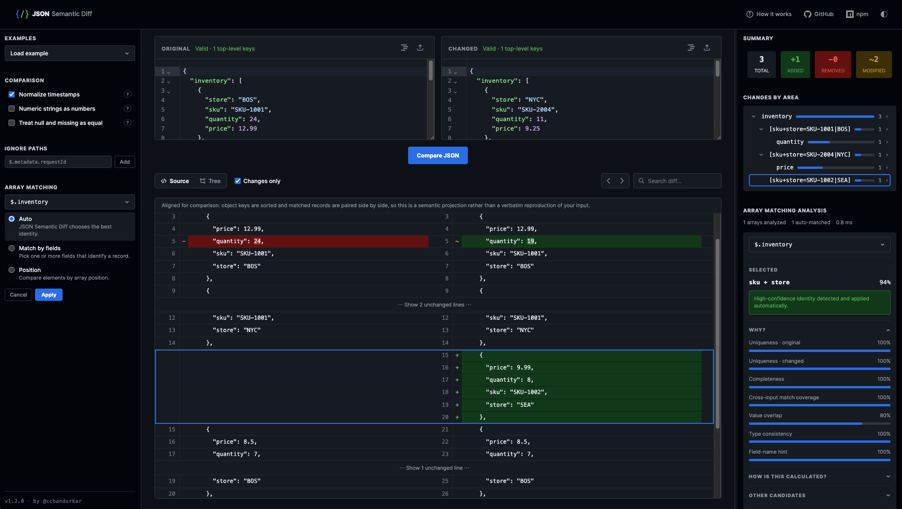
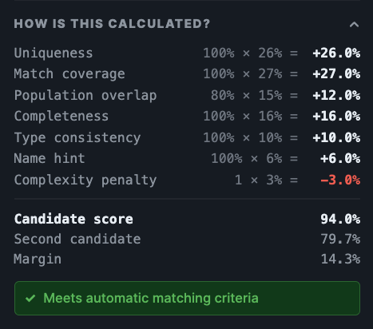

<div align="center">


<div id="toc">
  <ul style="list-style: none; margin-top:0">
    <summary>
      <h2>JSON Semantic Diff</h2>
    </summary>
  </ul>
</div>

[](https://github.com/cchandurkar/json-semantic-diff/actions/workflows/ci.yml) [](LICENSE)

JSON Semantic Diff is a local-first JSON comparison app focused on meaningful differences rather than line-oriented text changes. It matches reordered array rows by inferred identity, normalizes noisy fields like timestamps, and shows you what actually changed — not just where the bytes moved.



<a href="https://jsonsemanticdiff.dev">
  
</a>

</div>

## Why it's different

Click **Load example** in the demo. The `inventory` array is deliberately reordered and partially edited between inputs. Most JSON diff tools would report every reordered row as fully added/removed. JSON Semantic Diff instead infers an identity key (e.g. `store + sku`), matches rows across inputs by that identity, and surfaces only the fields that actually changed — with a confidence score and reasoning breakdown for every match, and a manual override if you disagree with its inference.

## Get started

```bash
npm install
npm run start --workspace=packages/ui
```

Open `http://localhost:4200`.

Production build:

```bash
npm run build --workspace=packages/ui
```

## Features

- Tree and raw-source diff views, side by side
- Smart array row matching by inferred identity (not just position)
- Confidence-scored matching analysis with manual override
- Timestamp and numeric-string normalization
- Ignore-path rules with wildcards
- Entire comparison runs in the browser — nothing is uploaded

## Use the diff engine standalone

Just want the diffing logic, not the UI? The core engine is framework-free and published to npm:

```bash
npm install json-semantic-diff
```

```ts
import { diffJson } from 'json-semantic-diff';

const result = diffJson(original, changed);
```

The package is ESM-only (no CommonJS `require` support) and requires Node ≥22.

See [`packages/core/README.md`](packages/core/README.md) for the full API reference.

## Repo structure

This repo is an npm-workspaces monorepo:

- `packages/core` — the framework-free diff engine, published to npm as [`json-semantic-diff`](https://www.npmjs.com/package/json-semantic-diff)
- `packages/ui` — the Angular app that consumes it

## Stack

- Angular 22
- Node 24
- TypeScript 6
- Angular CDK
- Tailwind CSS 4 + CSS variables

Node version is pinned via [`.nvmrc`](.nvmrc) (currently v24.17.0) — run `nvm use` from the repo root before installing/building.

## Scoring model

Identity inference lives in [`packages/core/src/diff/matching/identity-inference.ts`](packages/core/src/diff/matching/identity-inference.ts). Candidate quality considers uniqueness, completeness, match coverage, overlap, type consistency, a weak field-name hint, and volatility penalties. JSON Semantic Diff only auto-applies a candidate when both its score and its lead over competing candidates are strong enough.



## Analytics

The hosted demo uses [GoatCounter](https://www.goatcounter.com) for anonymous, cookie-free page-view analytics. It sets no cookies, no persistent identifiers, and collects no personal data — see GoatCounter's [privacy policy](https://www.goatcounter.com/privacy). Local development traffic (`localhost` and private IP ranges) is never tracked.

## Contributing

See [CONTRIBUTING.md](CONTRIBUTING.md) for setup, dev commands, and PR process, and `AGENTS.md` for product and implementation constraints. Licensed under [MIT](LICENSE).
